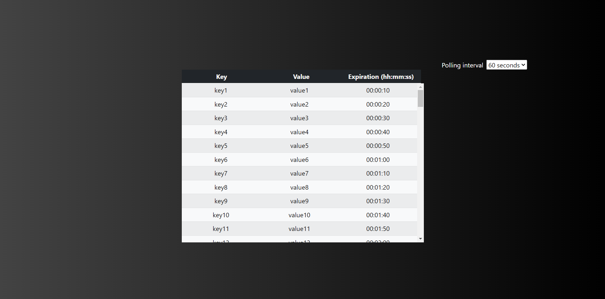

<h1 align="center">
  Nebula.InMemoryVisualizer
</h1>
<p align="center">
  Simplify the visualization of your In-Memory cache.
</p>

<p align="center">
  
</p>

## About

Most programming languages give you the possibility of having In-Memory cache, but there's a lack of tools that may allow you to visualize the content of such cache.

Nebula.Caching is an Open-Source project that aims at allowing you to have a way to visualize the contents of your In-Memory cache.

## How to run the project

### Via console

When inside src/src/ directory, you can run the following command:
```console
ng serve --configuration=<environment> --open
```
Currently, you can specify two values for the environment (to replace in the previous command):
- development: will have in consideration the variables defined in *environment.development.ts*
- production (default value assumed is nothing is passed on) : will have in consideration the variables defined in *environment.ts*

### Via Docker

Inside our src/ folder we have our Dockerfile and our docker-compose file.

To start the project via Docker, you just need to run the following command:

```console
docker-compose up -d
```

## Documentation

Our documentation can be found [here](docs/documentation/).

## Samples

Some useful code snippets can be found [here](docs/samples/).

## Contributing

This project welcomes and appreciates any contributions made.

There are several ways you can contribute, namely:

- Report any bug found.
- Suggest some features or improvements.
- Creating pull requests.

## License

Nebula.Caching is a free and open-source software licensed under the MIT License.

See [LICENSE](LICENSE) for more details.
