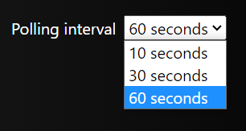

# Documentation entry point

## Environment configuration

As mentioned in the [wiki](../../README.md#via-console), we can specify the environment where the project will run at.
This decision will impact the variable values that will be use.

Next, we present the currently environment variables that we use, which you can see in the project under 
*environment.<supported_environmente>.ts*.

### apiUrl
This is the root URL of your backend application, where the in-memory cache data will be retrieved.

### inMemoryCacheRetrievalEndpoint
This is the endpoint within your *apiURL* where the data will actually be retrieved from.
This means that the in-memory cache would be at *<apiURL><inMemoryCacheRetrievalEndpoint>*.

> :warning: Must start with forward slash.

### localStoragePollingKey
This key is used to store your polling preferences, so that whenever you refresh your page those preferences are not lost.

### defaultPollingIntervalInSeconds
The interval duration from which the frontend will ask the backend for the current existing cache.
For example, if this value is 10 (seconds), your frontend will, every 10 seconds, ask the backend for the new in-memory cache and then render it.
One must be very careful with the value inserted here, so that we don't overload our system with these requests.

The value you can put here is one of the following:

